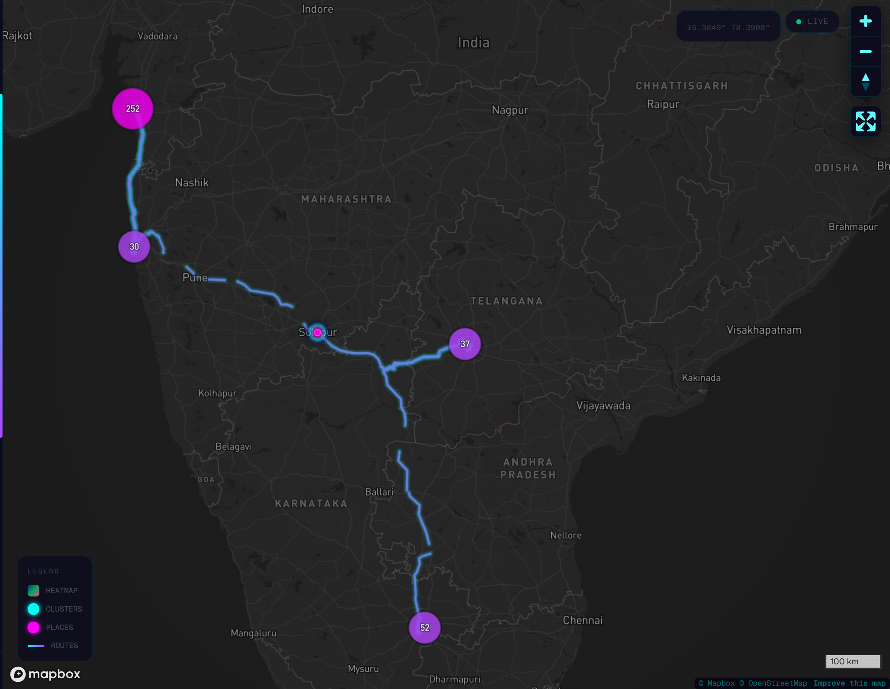
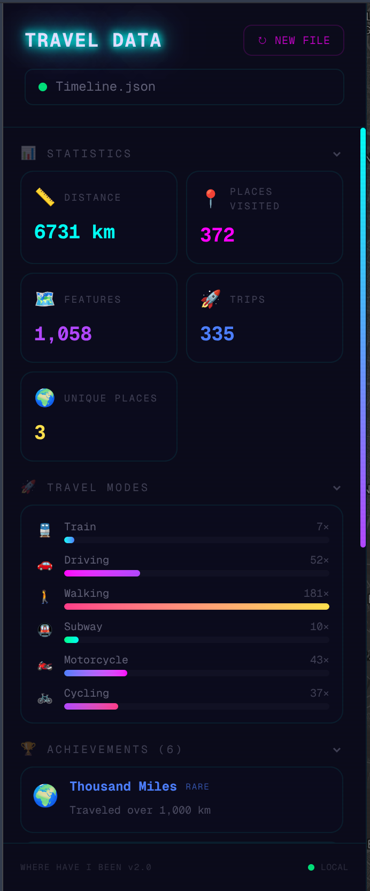

# 🌍 WHERE HAVE I BEEN

*Honestly, this was just a really fun project! I vibe-coded the whole thing because I just wanted to make an app that tracks all my footprints all over the world.*

A stunning, cyberpunk-themed travel visualization app that transforms your location history into an interactive map experience. Upload your travel data files and watch your journeys come alive with heatmaps, route animations, and rich statistics.

**🚀 Live Demo:** [https://where-have-i-been.vercel.app](https://where-have-i-been.vercel.app)

**100% private** — all processing happens locally in your browser. No data is ever sent to any server.

---

## 📸 Screenshots

*(Add a screenshot here showing the initial Drag and Drop upload zone with the cyberpunk glowing effects)*


*(Add a screenshot here showing the full map view with route lines and the dark map style)*


*(Add a screenshot here showing the expanded sidebar with travel statistics and badges)*


---

## ✨ Features

- **Multi-format Support** — GPX, KML, GeoJSON, Google Timeline JSON, Google Takeout Semantic Location History, Google Records JSON
- **Interactive Heatmap** — See where you spend the most time at a glance
- **Route Visualization** — Gradient-colored travel routes with glow effects
- **Clustered Points** — Intelligently grouped location markers that expand on zoom
- **3D Terrain** — Tilt the map to see terrain elevation with atmospheric sky
- **4 Map Styles** — Dark, Satellite, Streets, Terrain — switch anytime
- **Travel Statistics** — Distance, places visited, trips, duration, elevation, speed
- **Travel Mode Breakdown** — Visual chart showing your transport modes (driving, walking, cycling, etc.)
- **Achievement System** — Earn badges for travel milestones (distance, places, elevation, multimodal travel)
- **Rich Popups** — Click any point to see visit details, duration, and timestamps
- **Cyberpunk Aesthetic** — Neon glows, scanlines, animated particles, glassmorphism
- **Fully Responsive** — Works on desktop and mobile with collapsible sidebar
- **Keyboard Shortcuts** — Press `Esc` to toggle sidebar

## 🚀 Getting Started

### Prerequisites

- Node.js 18+
- A [Mapbox](https://mapbox.com) access token (free tier is sufficient)

### Installation

```bash
# Clone the repository
git clone https://github.com/your-username/where-have-i-been.git
cd where-have-i-been

# Install dependencies
npm install

# Create environment file
cp .env.example .env.local
# Edit .env.local and add your Mapbox token

# Start development server
npm run dev
```

### Environment Variables

| Variable | Description | Required |
|----------|-------------|----------|
| `NEXT_PUBLIC_MAPBOX_ACCESS_TOKEN` | Your Mapbox GL access token | ✅ |

### Building for Production

```bash
npm run build
npm start
```

## 📁 Supported File Formats

| Format | Extension | Description |
|--------|-----------|-------------|
| **GPX** | `.gpx` | GPS Exchange Format (Strava, Garmin, etc.) |
| **KML** | `.kml` | Google Earth / Google My Maps |
| **GeoJSON** | `.geojson` | Standard geographic JSON |
| **Google Timeline** | `.json` | Modern Google Timeline export (2024+, `semanticSegments`) |
| **Google Takeout** | `.json` | Legacy Semantic Location History (`timelineObjects`) |
| **Google Records** | `.json` | Raw location records (`locations` array) |

## 🏗️ Architecture

```
app/
├── page.js                 # Main app entry with state management
├── layout.js               # Root layout with SEO meta tags
├── globals.css             # Design system (cyberpunk theme, animations)
├── components/
│   ├── DropZone.js         # File upload with particle animation
│   ├── MapView.js          # Mapbox GL map with all layers & interactions
│   ├── Sidebar.js          # Stats, achievements, travel modes, map styles
│   └── ErrorBoundary.js    # Graceful crash recovery
└── utils/
    ├── fileParser.js       # Multi-format parser (GPX, KML, GeoJSON, Google)
    └── achievements.js     # Travel achievement/badge system
```

## 🛡️ Privacy

This app is designed with privacy as a core principle:

- **No server uploads** — All file parsing happens client-side in your browser
- **No analytics** — No tracking scripts, no cookies, no data collection
- **No external requests** — Only Mapbox tile requests for the map
- **Open source** — Inspect the code yourself

## 📄 License

MIT

---

Built with [Next.js](https://nextjs.org), [Mapbox GL JS](https://mapbox.com), and a love for travel 🌏
